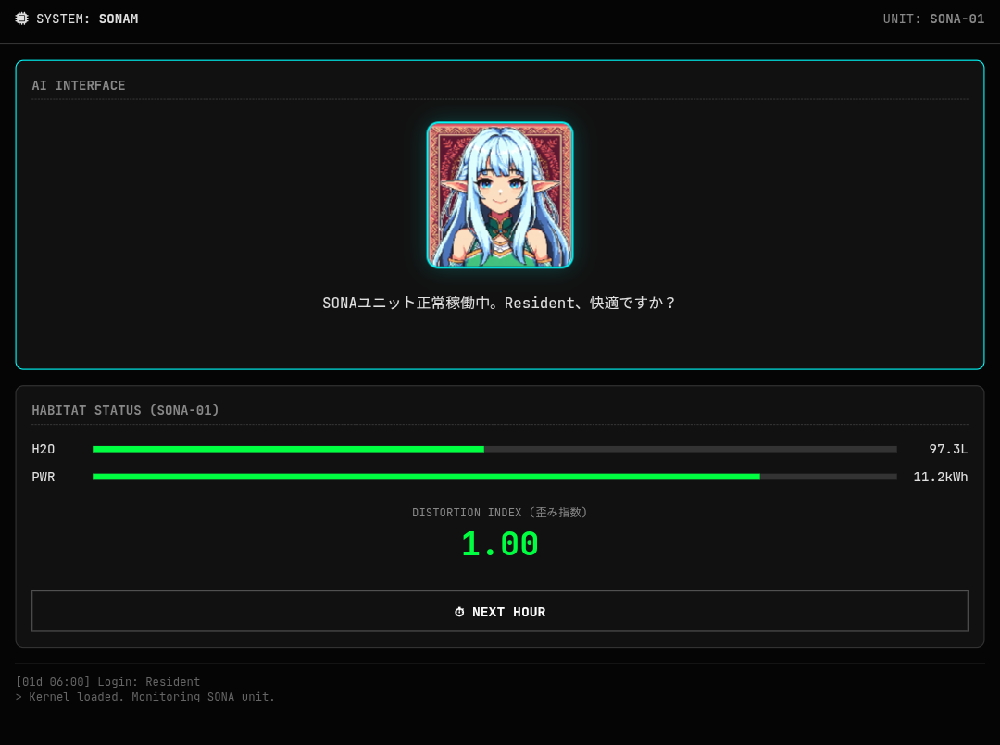

# 🌌 SONAM
**The Operating System for Standard Blocks.**

[]()
[](https://pyscript.net)
[](LICENSE)

> **"In the beginning was the Logic. And the Logic became the Heart."**

**SONAM** is a **Habitat Control Kernel** designed for the "Standard Block" (autonomous living units/space colonies) defined in SBCM Theory.
It translates the complex thermodynamics of resource management (Water, Power, Entropy) into an **Emotional Interface**, enabling intuitive optimization of life support systems.

---

### 🖥️ Interface


---

## 📖 Concept

In a closed ecosystem—such as a space colony or an isolated rural block—resource mismanagement ($D_{index} > 1$) leads directly to collapse.
However, constant numerical monitoring induces fatigue in residents.

**SONAM** solves this by converting the **Distortion Index ($D_{index}$)** into the emotions of **"Sona,"** an AI avatar.

*   **SONA (Unit):** The physical housing unit (Hardware).
*   **SONAM (System):** The operating system managing the unit (Software).

## 🚀 Features

### 1. Emotional Feedback Loop
Residents do not need to understand thermodynamics. They only need to care about Sona.
*   **Green State ($D_{index} \approx 1.0$):** Sona smiles and chats casually.
*   **Red State ($D_{index} > 2.0$):** Sona expresses distress and issues warnings.
**Result:** Users optimize resources (saving water/power) not for "compliance," but to "keep Sona happy."

### 2. Edge-Native & Instant Boot
Designed for environments where cloud dependency is a risk (e.g., Mars-Earth latency).
*   **MicroPython:** Built with the lightweight version of PyScript.
*   **Instant Load:** Boots in milliseconds.
*   **Offline First:** Runs entirely in the browser (Client-side) without a backend server.

## 🛠️ Usage

Simply open `index.html` in any modern web browser. No installation required.

```bash
# 1. Clone the repository
git clone https://github.com/SBCM-Alliance/sonam.git

# 2. Run locally (optional, can be opened directly)
cd sonam
python3 -m http.server

# 3. Access http://localhost:8000
```

## 🔗 The SBCM Ecosystem

SONAM is the "Life OS" component of the SBCM Alliance project.

*   **[Core Theory](https://github.com/SBCM-Alliance/core-theory):** The mathematical foundation (Physics).
*   **[Pithos OS](https://github.com/SBCM-Alliance/pithos):** The weapon to fix the *current* world.
*   **SONAM:** The lifestyle OS for the *future* world.

---
<p align="center">
  <small>© 2025 SBCM Alliance. Powered by Algorithmic Public Interestism.</small>
</p>
